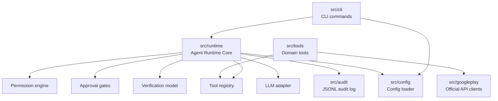

# Architecture

PlayOps module map (mirrors `src/`). Implementation order follows `PLAYOPS_PLAN.md` phases.

## Module responsibilities

| Module           | Phase | Responsibility                                                                                                            |
| ---------------- | ----- | ------------------------------------------------------------------------------------------------------------------------- |
| `src/config`     | 0.5   | Load `config/playops.yaml` + env overrides; typed config object                                                           |
| `src/audit`      | 0.6   | Append-only JSONL audit log writer/reader                                                                                 |
| `src/googleplay` | 1     | Auth (service account → OAuth2), Android Publisher client, Reporting client, shared retry/rate-limit                      |
| `src/runtime`    | 2     | Tool registry, permission engine, approval gates, verification model, LLM adapter, agent loop, browser-fallback interface |
| `src/tools`      | 3–5   | Domain tools registered into the runtime: reviews (3), releases (4), health (5)                                           |
| `src/cli`        | 1.4+  | CLI commands wiring config, runtime, and tools (`doctor`, `reviews`, `releases`, `health`)                                |

## Rules

- Domain tools **must** register into the real Phase 2 runtime — no temporary scaffolding.
- Every mutating tool declares permission level + post-action verification.
- `destructive`/`publish` require human approval by default; approvals are audit-logged.
- No runtime dependency on Hermes. No Android artifact building.
